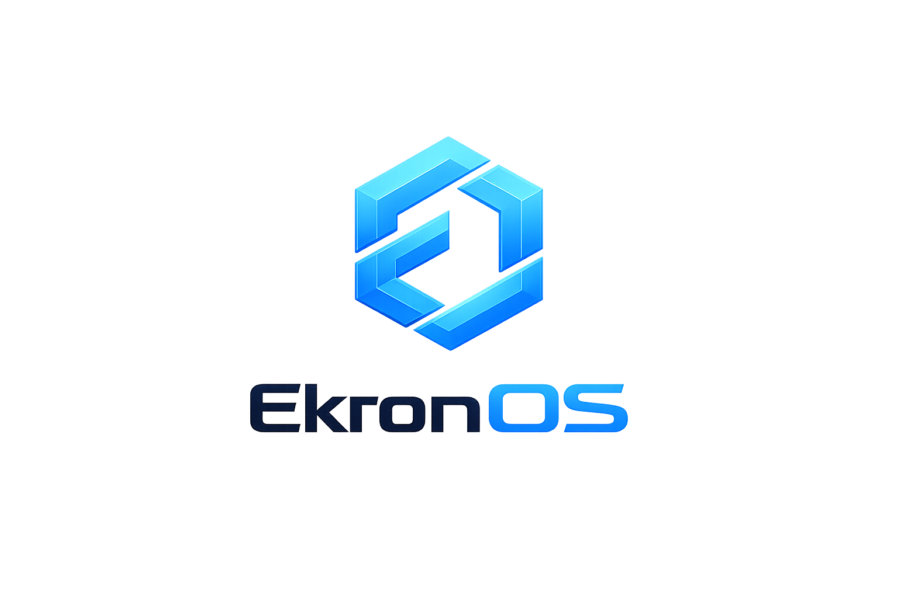

# EkronOS — Economic Infrastructure Layer for Programmable Markets

  

**EkronOS** is the economic infrastructure layer designed to transform ideas into live, liquidity-connected **programmable markets** on the Vara Network.  
This repository contains the core infrastructure and tools to deploy **modular, incentive-driven market systems** that generate real onchain activity from day one.

🚫 Not a token generator  
🚫 Not an AI code builder  
🎯 **A market creation engine**

---

## 🚀 What EkronOS Is

EkronOS enables anyone — developers, communities, or product creators — to deploy **fully configured programmable markets** with:

- ✅ Token logic & supply models  
- ✅ Treasury management  
- ✅ Incentive engines  
- ✅ Integrated liquidity via RivrDEX  
- ✅ Risk & sustainability scoring  
- ✅ Frontend interfaces with live metrics  

Every market is launched with **liquidity, incentives, and governance primitives built in**, enabling real participation instead of speculation.

---

## 🧠 Key Concepts

### 🧩 Programmable Markets

Rather than just minting tokens or generating code, EkronOS orchestrates markets composed of **modular economic primitives** such as:

- **Token Module**
- **Liquidity Module**
- **Incentives Module**
- **Treasury Module**
- **Governance Module** (optional)
- **Risk & Safety Module**

These modules are combined into **complete economic systems** that function like real-world markets, not speculative assets.

---

## ⚙️ Features

### 1. One-Step Deployment

Define a structured prompt and submit it. EkronOS parses it and deploys:

- Token (VFT) contracts with configurable rules  
- Treasury vaults with routing logic  
- Incentive engines and optional staking  
- Safety and emergency controls  

---

### 2. Native Liquidity via RivrDEX

Every deployment automatically:

- ✔️ Creates a liquidity pool  
- ✔️ Provisions initial liquidity  
- ✔️ Optionally locks LP  
- ✔️ Configures rewards and farming  

Liquidity isn’t an afterthought — **it’s embedded at launch**.

---

### 3. Risk-Aware Deployment

EkronOS evaluates each market before deployment using:

- Inflation risk  
- Liquidity depth risk  
- Concentration risk  
- Incentive balance  
- Utility gap analysis  

Markets that fail basic criteria remain **paused until corrected**.

---

### 4. Creator Experience

EkronOS provides a **no-code friendly, guided UX**:

- Define market requirements  
- Review automated tokenomics blueprint  
- Deploy with guided wizard  
- Publish live interface with swap, dashboard, and admin console  

---

---

## 🧪 MVP Focus

The initial release targets:

- ✔️ Standardized token template  
- ✔️ Treasury routing logic  
- ✔️ Basic incentive engine  
- ✔️ RivrDEX integration  
- ✔️ Public dashboard  
- ✔️ Risk scoring (v1)  

**Core flow:**

> **Prompt → Market → Liquidity → Live Participation**

---

## 🛣 Roadmap

| Phase | Focus |
|------|------|
| **Phase 1 — Vara Native** | Markets deploy fully on Vara with RivrDEX liquidity |
| **Phase 2 — Ethereum + Vara.eth** | Tokens on Ethereum, market logic on Vara, dual-layer execution |
| **Future — Agentic Economy** | Autonomous agents orchestrate and scale economic networks |

---

## 📈 Why It Matters

Crypto today is filled with token launches and speculative products — but few **real economic systems** that create meaningful participation and value.

EkronOS is positioned to become:

- A **liquidity engine** for Vara (TVL + volume)  
- A **standardized economic layer**  
- A **gateway for new protocols**  
- A **bridgeable infrastructure toward Ethereum**  

This shifts the paradigm from **token creation** to **market orchestration**.

---

## 🤝 How to Contribute

We welcome contributions in:

- ✨ Smart contract improvements  
- ✨ Frontend UI enhancements  
- ✨ Economic primitives and modules  
- ✨ Documentation and examples  
- ✨ Community tooling and integrations  

---

**EkronOS** — Build markets, not tokens.
